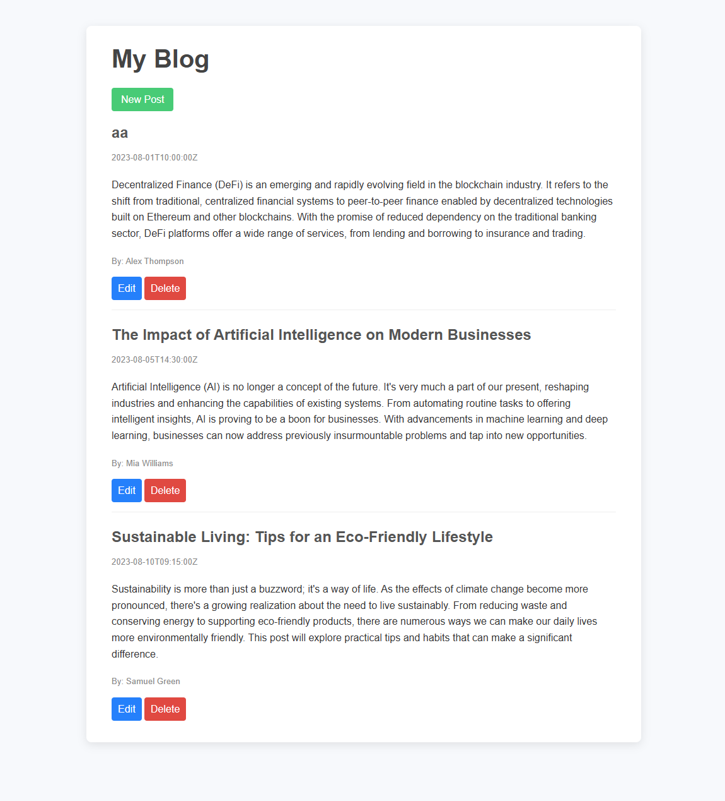

# Blog API

[]()

A web interface to manage blog posts via a REST API. This project allows you to create, edit, delete, and display posts by connecting to a Node.js/Express API.

## ✨ Features

- **Display posts:** Lists all blog posts on the homepage.
- **Create post:** Form to add a new post.
- **Edit post:** Form to update an existing post.
- **Delete post:** Quickly remove a post from the interface.
- **Responsive design:** Works on all screens (desktop, tablet, mobile).
- **REST API connection:** Uses Axios to communicate with the backend API.

## 🛠️ Technologies Used

- **Frontend:**
  - HTML
  - CSS
  - EJS (templates)
  - JavaScript
- **Backend (API):**
  - Node.js
  - Express
  - Body-parser
  - Axios
- **Other:**
  - Git for version control

## Installation

1. **Clone the repository:**

   ```bash
   git clone https://github.com/Antoinekoe/blog-api.git
   cd blog-api-frontend
   ```

2. **Install dependencies:**

   ```bash
   npm install
   ```

3. **Start the server:**

   ```bash
   nodemon server.js
   ```

   The app will be available at `http://localhost:3000`.

4. **Start the backend API:**

   ```bash
   cd ../blog-api
   nodemon index.js
   ```

   The API should run at `http://localhost:4000` by default.

## 🗂️ Project Structure

```
Blog API/
├── public/
│   └── styles/
│       └── main.css        # Main CSS file
├── views/
│   ├── index.ejs           # Homepage (list of posts)
│   └── modify.ejs          # Create/edit post form
├── index.js                # Backend API entry point
├── package-lock.json       # npm lock file
├── package.json            # npm config file
├── README.md               # This file
├── LICENSE                 # License file
└── server.js               # Frontend application entry point
```

## 🤝 How to Contribute

Contributions are welcome!

1. **Fork the repository.**
2. **Create a branch for your feature or fix:**

   ```bash
   git checkout -b feature/my-new-feature
   # or
   git checkout -b bugfix/bug-fix
   ```

3. **Make your changes and commit with a clear message.**
4. **Push your branch to your fork:**

   ```bash
   git push origin feature/my-new-feature
   ```

5. **Create a pull request to the `main` branch of the original repository.**

## 🔧 Potential Improvements (TODO)

- Add authentication for post management.
- Pagination or search for posts.
- Add user notifications.
- Improve accessibility.
- Add automated tests.

## 🔑 License

This project is licensed under the MIT License - see the [LICENSE](LICENSE) file for details.
